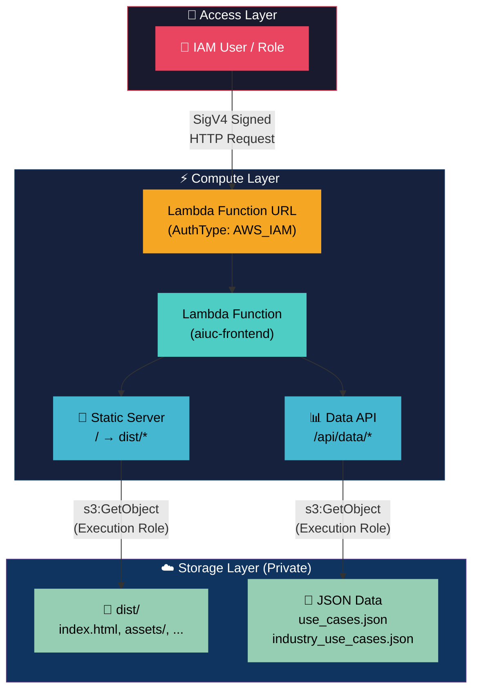

<p align="center">
  
</p>

<h1 align="center">AI Use Case Repository</h1>

<p align="center">
  <strong>Internal AI use case & industry data dashboard — secured with AWS IAM</strong>
</p>

<p align="center">
  
  
  
  
</p>

<p align="center">
  
  
  
  
</p>

<p align="center">
  
  
  
</p>

---

## 📋 Table of Contents

- [Overview](#overview)
- [Architecture](#architecture)
- [Project Structure](#project-structure)
- [Prerequisites](#prerequisites)
- [Local Development](#local-development)
- [Deployment](#deployment)
- [Granting User Access](#granting-user-access)
- [Testing Access](#testing-access)
- [Tech Stack](#tech-stack)

---

## Overview

The **AI Use Case Repository** is an internal dashboard that surfaces AI use case data and industry-specific AI implementation records. The frontend is a React SPA served through an **AWS Lambda Function URL** with **IAM authentication**, ensuring only authorized personnel can access the application and its data.

> **🔒 Confidential — Internal Use Only**

---

## Architecture



> ❌ Direct S3 access → **BLOCKED** (PublicAccessBlock enabled)
> ❌ Unsigned Lambda URL request → **403 Forbidden**
> ✅ Signed request + IAM policy → **Full app access**

### How It Works

| Step | Description |
|------|-------------|
| **1** | Authorized user sends a **SigV4-signed** HTTP request to the Lambda Function URL |
| **2** | AWS validates the signature and checks `lambda:InvokeFunctionUrl` permission |
| **3** | Lambda receives the request and determines if it's a static asset or data API call |
| **4** | Lambda fetches the requested content from the **private S3 bucket** using its execution role |
| **5** | Response is returned to the user — the website loads with all data |

> Users **never access S3 directly**. The Lambda acts as a secure proxy.

---

## Project Structure

```
aiuc.spearehead/
├── src/                        # React frontend source
│   ├── App.tsx                 # Main application component
│   ├── components/             # UI components (tables, logo)
│   ├── hooks/
│   │   └── useS3Data.ts        # Data fetching via /api/data/*
│   ├── theme.ts                # MUI theme configuration
│   ├── types.ts                # TypeScript interfaces
│   └── globals.css             # Global styles
├── lambda/
│   ├── index.mjs               # Lambda handler (serves FE + data API)
│   └── package.json            # Lambda dependencies (@aws-sdk/client-s3)
├── package.json                # Frontend dependencies
├── vite.config.ts              # Vite configuration
└── .env                        # Environment variables (S3_REGION, BUCKET_NAME)
```

---

## Prerequisites

Before deploying, ensure you have the following installed:

| Tool | Version | Purpose |
|------|---------|---------|
| **Node.js** | ≥ 18.x | Build the frontend |
| **npm** | ≥ 9.x | Package management |
| **AWS Account** | N/A | Access to Lambda, S3, and IAM |

```bash
# Verify installations
node --version
aws --version
sam --version
```

Configure AWS CLI with credentials that have admin/deploy permissions:
```bash
aws configure
```

---

## Local Development

```bash
# Install dependencies
npm install --legacy-peer-deps

# Start development server
npm run dev

# Build for production
npm run build

# Preview production build
npm run preview
```

> ⚠️ **Note:** In local dev, the `/api/data/*` routes won't work unless you set up a local proxy or temporarily revert to direct S3 fetch for development.

---

## Deployment

### Automated Deployment (GitHub Actions)

The recommended way to deploy is through GitHub Actions. Pushing to the `main` branch will automatically build the frontend, sync assets to S3, and update the Lambda function.

#### Setup (One-time)
Add the following **Secrets** to your GitHub repository (`Settings` > `Secrets` > `Actions`):
- `AWS_ACCESS_KEY_ID`
- `AWS_SECRET_ACCESS_KEY`
- `AWS_REGION` (e.g., `us-east-2`)
- `S3_BUCKET_NAME` (e.g., `auic`)
- `LAMBDA_FUNCTION_NAME` (e.g., `dev-aiuc-frontend`)

### Manual GUI Deployment (AWS Console)

#### 1. Build & Package
1. Run `npm run build` in the project root.
2. Run `cd lambda && npm install --omit=dev && zip -r ../lambda.zip . && cd ..`.

#### 2. Upload Static Assets to S3
1. Open the **S3 Console** and select your bucket (`auic`).
2. Upload the **contents** of your local `dist/` folder into a folder named `dist` in the bucket.

#### 3. Update Lambda Function
1. Open the **Lambda Console** and select your function (`dev-aiuc-frontend`).
2. In the **Code** tab, select **Upload from** → **.zip file** and upload `lambda.zip`.
3. In the **Configuration** tab → **Environment variables**, ensure these are set:
   - `BUCKET_NAME`: `auic`
   - `S3_REGION`: `us-east-2`
   - `DIST_PREFIX`: `dist`

#### 4. Configure Access (Choose One Option)

##### Option A: IAM Authentication (Highly Secure)
1. In **Configuration** tab → **Function URL** → **Edit**:
   - **Auth type**: `AWS_IAM`.
2. Attach S3 Permissions to the Lambda Role:
   - Go to **Configuration** → **Permissions** → Click your **Role Name**.
   - **Add permissions** → **Create inline policy** (JSON):
     ```json
     {
         "Version": "2012-10-17",
         "Statement": [{
             "Effect": "Allow",
             "Action": ["s3:GetObject", "s3:ListBucket"],
             "Resource": ["arn:aws:s3:::auic", "arn:aws:s3:::auic/*"]
         }]
     }
     ```

##### Option B: Public Access (No-Auth)
1. In **Configuration** tab → **Function URL** → **Edit**:
   - **Auth type**: `NONE`.
2. Add Resource-based Policy (to avoid 403 Forbidden):
   - Go to **Configuration** → **Permissions**.
   - Scroll to **Resource-based policy statements** → **Add permissions**.
   - Select **Function URL**.
   - **Auth type**: `NONE`, **Principal**: `*`, **Action**: `lambda:InvokeFunctionUrl`.
   - Click **Save**.
3. *Note: Lambda still needs the S3 Inline Policy from Option A to fetch the files.*

### Deployment Output

After successful deployment, you'll see:

```
═══════════════════════════════════════════════════════
  Deployment Complete!
═══════════════════════════════════════════════════════

  🔗 Lambda Function URL : https://xxxxx.lambda-url.ap-southeast-2.on.aws/
  🔑 Access Policy ARN   : arn:aws:iam::xxxx:policy/aiuc-frontend-access
```

---

## Granting User Access

### Attach the managed policy to an IAM user

```bash
aws iam attach-user-policy \
  --user-name <USERNAME> \
  --policy-arn <ACCESS_POLICY_ARN>
```

### Attach to an IAM role

```bash
aws iam attach-role-policy \
  --role-name <ROLE_NAME> \
  --policy-arn <ACCESS_POLICY_ARN>
```

### What the policy grants

```json
{
  "Effect": "Allow",
  "Action": "lambda:InvokeFunctionUrl",
  "Resource": "arn:aws:lambda:<region>:<account>:function:aiuc-frontend"
}
```

> That's it — **one permission**. The Lambda's execution role handles all S3 access internally.

---

## Testing Access

### ✅ With authorized credentials

```bash
curl --aws-sigv4 "aws:amz:ap-southeast-2:lambda" \
  --user "$AWS_ACCESS_KEY_ID:$AWS_SECRET_ACCESS_KEY" \
  "https://<function-url-id>.lambda-url.ap-southeast-2.on.aws/"
```

### ❌ Without credentials (should return 403)

```bash
curl "https://<function-url-id>.lambda-url.ap-southeast-2.on.aws/"
# → {"Message":"Forbidden"}
```

### ❌ Direct S3 access (should fail)

```bash
aws s3 ls s3://aiuc/ --no-sign-request
# → An error occurred (AccessDenied)
```

---

## Tech Stack

<p align="center">

| Layer | Technology | Badge |
|-------|-----------|-------|
| **Frontend** | React 19 + TypeScript |  |
| **UI Library** | Material UI 5 |  |
| **Build Tool** | Vite 7 |  |
| **Tables** | TanStack Table v8 |  |
| **Runtime** | AWS Lambda (Node.js 20) |  |
| **Storage** | Amazon S3 (Private) |  |
| **Auth** | AWS IAM |  |
| **IaC** | Manual / AWS Console |  |

</p>

---

<p align="center">
  <sub>Powered by <strong>Spearhead</strong> • Confidential – Internal Use Only</sub>
</p>
